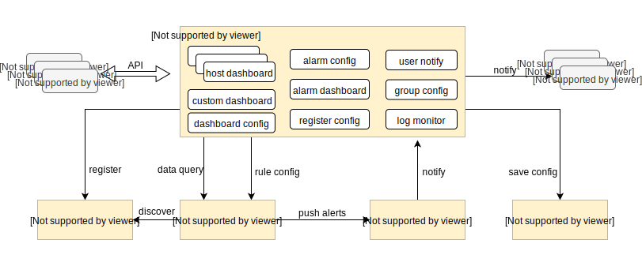

# WeCube-plugins-prometheus 监控插件

中文 / [English](README_EN.md)

## 试用链接
[点此试用WeCube-plugins-prometheus](http://119.28.38.23:38082/wecube-monitor)

## 引言
Prometheus是由SoundCloud开发的开源监控报警系统和时序列数据库(TSDB)。Prometheus使用Go语言开发，是Google BorgMon监控系统的开源版本。

Prometheus 监控插件包括几个组成部分： Prometheus Server、Consul、Alert Manager、监控应用程序。

WeCube-plugins-prometheus 无侵入式地封装了Prometheus的功能，并提供更好的告警管理和图表展示，以及与其它系统的交互等

## 系统架构
整体架构图如下:  

## 简介
WeCube通过监控插件来对资源以及应用的监控及告警。

此插件底层引用Prometheus，上层Monitor封装了对Prometheus的配置管理和图表展示，Monitor后端技术选型为Go + Gin + Xorm, 前端技术选型为Vue + ECharts。

**Monitor具备以下特点：**

- 管理监控对象

    支持对象的注册和注销，并在对接了CMDB的情况下可主动从CMDB同步监控对象  
    支持监控对象的组管理，可对组进行告警配置  
    
- 友好的视图

    默认提供主要监控对象类型的指标视图，包括主机、mysql、redis、tomcat等  
    提供Prometheus原生PromQL查询与查询指标配置保存  
    提供自定义视图的功能  
    
- 管理告警

    提供对Prometheus告警规则配置的持久化与下发  
    提供未恢复告警面板展示与历史告警  
    提供对象告警配置与组告警配置  
    提供告警接收方管理  
    

## 主要功能
监控插件包括以下功能：

- agent管理: 注册、启动、停止；
- 数据管理: 提供数据采集配置， 数据查询等功能；
- 告警管理: 提供阈值配置、日志监控、告警触发等功能；
- 视图管理: 提供图形配置和自定义视图功能；

## 快速入门
WeCube-plugins-prometheus采用容器化部署。

如何编译，请查看以下文档
[WeCube-plugins-prometheus编译文档](wiki/compile_guide.md)

如何安装， 请查看以下文档
[WeCube-plugins-prometheus部署文档](wiki/install_guide.md)

agent安装文档
[Prometheus-agent安装文档](wiki/install_agent.md)

## 版权声明
WeCMDB是基于 Apache License 2.0 协议， 详情请参考
[LICENSE](LICENSE)

## 社区
- 如果您想得到最快的响应，请给我们提[Issue](https://github.com/WeBankPartners/wecube-plugins-prometheus/issues/new/choose)或扫描下面的二维码，我们会第一时间反馈。

	

	
	

- 联系我们：fintech@webank.com