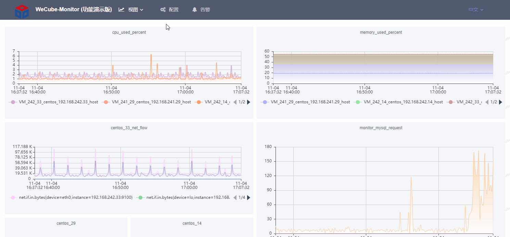
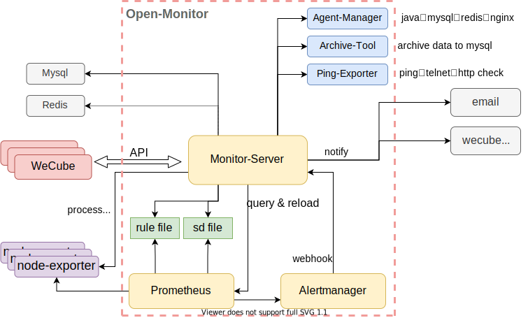

# Open-Monitor 监控插件

    
    
    
    
    
    
    

中文 / [English](README_EN.md)

## 在线体验环境

  
若希望更好的体验可参照：[Open-Monitor部署文档](wiki/install_guide.md) 搭建私有环境

## 引言  
Prometheus是由SoundCloud开发的开源监控报警系统和时序列数据库(TSDB)。Prometheus使用Go语言开发，是Google BorgMon监控系统的开源版本。

Open-Monitor 无侵入式地封装了Prometheus的功能，并提供更好的告警管理和图表展示，以及监控配置管理与其它系统的交互等。  

Open-Monitor 包含的组件有Prometheus、Alertmanager、Monitor、Agent_manager、Ping_exporter、Archive_mysql_tool等。

## 系统架构
整体架构图如下:  

## 简介
WeCube通过Open-Monitor监控插件来对资源以及应用的监控及告警。

此插件底层引用Prometheus，上层Monitor封装了对Prometheus的配置管理和图表展示，并增加了一系列企业级监控的通用功能，Monitor-Server技术选型为Go + Gin + Xorm + Zap, 前端技术选型为Vue + ECharts。

**Open-Monitor具备以下功能点：**

- 管理监控对象

    支持对象的注册和注销，并在对接了CMDB的情况下可主动从CMDB同步监控对象  
    支持监控对象的组管理，可对组进行告警配置  
    支持层级组织结构，来对监控对象作业务和组织构架上的划分  
    支持进程监控  
    支持业务日志监控
    
    
- 友好的视图

    默认提供主要监控对象类型的指标视图，主要包括主机、mysql、redis、java、系统视图等  
    提供Prometheus原生PromQL查询与查询指标配置保存  
    提供高度可配置化的自定义视图的功能，并且可把自定义视图设置为首页  
    
- 管理告警

    提供对Prometheus告警规则配置的持久化与下发  
    提供未恢复告警面板展示与历史告警  
    提供对象告警配置与组告警配置  
    提供告警接收方管理  
    提供自集成的邮件通知功能  
    
- 管理监控agent

    提供agent_manager组件来提供方便快捷的 mysql、redis、jmx、nginx监控
    
- 包含一系列检测工具

    提供ping、telnet、http等方式的存活性检测方式，可直接在界面上增加对应的监控对象基础信息即可直接监控
    
- 监控数据归档

    提供程序自动归档监控数据到mysql中，自动管理分库分表，图表读取适配多处数据整合

    **部署建议：** `archive_mysql_tool` 建议在监控集群中单独挑选 1 台（或 1 主 1 备）服务器启用归档任务，其它节点保持 `enable=false`。这样可以避免多机重复归档导致的重复写入和锁竞争，只需确保该节点能访问 Prometheus 与归档 MySQL，即可为所有监控实例统一落库。

    **配置注意：** 若有多台 `monitor-server` 访问同一归档库，务必确认 `monitor-server/conf/default.json`（以及编排模版 `build/conf/monitor.json`）里的 `archive_mysql.maxOpen/maxIdle` 使用驼峰命名，并结合系统变量设置连接池上限，未配置时系统会回落到 `maxOpen=80 / maxIdle=10 / timeout=60` 的默认值，避免连接池失控。
    

## 主要功能
监控插件包括以下功能：

- agent管理: 注册、启动、停止；
- 数据管理: 提供数据采集配置， 数据查询等功能；
- 告警管理: 提供阈值配置、日志监控、告警触发等功能；
- 视图管理: 提供图形配置和自定义视图功能；

## 快速入门
Open-Monitor采用容器化部署。

如何编译，请查看以下文档
[Open-Monitor编译文档](wiki/compile_guide_new.md)

如何安装， 请查看以下文档
[Open-Monitor部署文档](wiki/install_guide.md)

agent安装文档
[Prometheus-agent安装文档](wiki/install_agent.md)

## 用户手册
关于Open-Monitor的使用和操作说明，请查看文档[Open-Monitor用户手册](wiki/user_guide.md)

## 开发者文档
**Open-Monitor本地环境搭建与开发**  
请参考本地开发环境配置文档 [Open-Monitor本地环境配置文档](wiki/develop_local_guide.md)

## 版权声明
Open-Monitor是基于 Apache License 2.0 协议， 详情请参考
[LICENSE](LICENSE)

## 社区
- 如果您想得到最快的响应，请给我们提[Issue](https://github.com/WeBankPartners/open-monitor/issues/new/choose)或扫描下面的二维码，我们会第一时间反馈。

	

	
	

- 联系我们：fintech@webank.com
