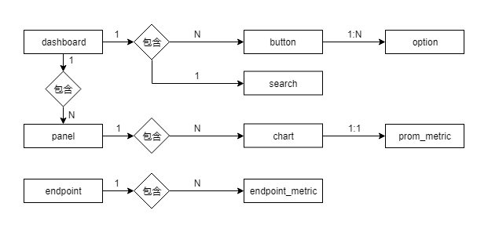

# Monitor-server
Monitor-server 是由Go语言开发的监控服务后端程序，封装了对Prometheus的数据查询和对监控资源的管理。

## 技术实现
HTTP路由引用Gin，数据库连接引用Xorm，日志引用Zap，DB使用Mysql

## 主要功能
- 视图管理: 提供Host、Mysql、Redis基础指标视图和自定义视图
- agent管理: 提供监控对象的注册注销和启停功能
- 告警管理: 提供阀值配置、告警组管理、屏蔽告警、发送告警等功能

## 数据库设计

主要的一些表说明：
- endpoint 纪录监控主体的一些基础信息，包括采集的地址、主机名(实例名)、版本、采集周期等
- endpoint_metric 纪录endpoint的指标信息
- dashboard、panel、chart、button、search、option这些表用于监控视图的展示配置
- prom_metric用于纪录展示的指标名和promQL之间的转换关系

## 编译打包
```shell
go get https://github.com/WeBankPartners/wecube-plugins-prometheus
cd $GOPATH/src/github.com/WeBankPartners/wecube-plugins-prometheus/monitor-server
go build
```
## 运行
运行需要依赖如下几个服务
- Prometheus 历史数据查询、告警配置
- Consul 监控主体的注册与注销
- Mysql 配置数据持久化  

Mysql脚本  
- [表结构monitor_struct.sql](../wiki/db/monitor_struct.sql)  
- [表基础数据monitor_portal_base_data.sql](../wiki/db/monitor_portal_base_data.sql)

修改配置文件conf/default.json里的依赖地址，直接运行  
后续会提供shell脚本管理程序的启停...