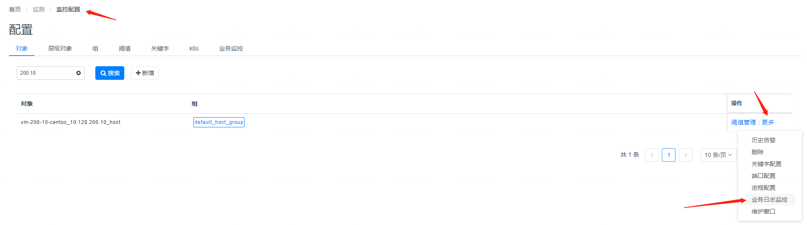
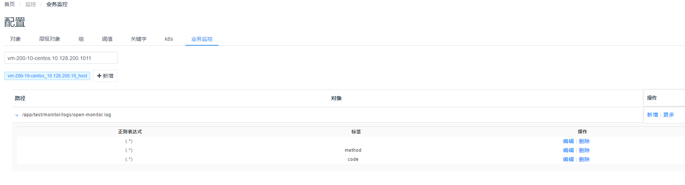
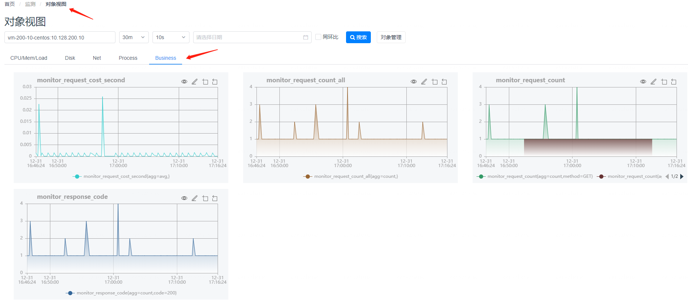

# Open-Monitor业务指标配置

## 一、	监控方式说明
#### 1、内容匹配
通过业务系统打的业务日志来采集业务指标，日志以行为单位，每一行都会去尝试匹配在Open-Monitor业务监控里配置好的正则表达式，如果匹配上了会去尝试解析匹配上的Json字符串，进而拿到里面的key、value。  
比如说：  
```
正则表达式：\[.*\]\[.*\]\[.*\]\[.*\]\[.*\]\[.*\]\[.*\]\[(.*)\]\[.*\]  
日志行：[INFO][2020-01-01 10:00:00 169][ConsumeMessageThread_9][][20111201A][][][{"costTime":52,"method":”GET","resCode":"200"}][]  
```
匹配上了正则后，会去尝试拿小括号()里面匹配上的子字符串做json解析，可以配多段json内容，只是尽量不要里面的key一样，会被覆盖。
解析后会拿到如下的内容  
```
{"costTime":52,"method":”GET","resCode":"200"}
```

#### 2、指标计算
因为Prometheus的采集方式是server向client拉数据，间隔现在默认是10秒，所以需要对10秒期间内的多行日志数据指标做聚合，现在支持三种聚合方式：avg(平均)，sum(累加)，count(计数)。  
比如说：  
10秒内的日志每行匹配到的json如下  
```
{"costTime":52,"method":”GET","resCode":"200"}  
{"costTime":137,"method":”POST","resCode":"200"}  
{"costTime":28,"method":”GET","resCode":"404"}  
```
要配置出 请求的平均耗时、总请求数、各方式(GET/POST)的请求数、请求成功率  
需要配置三组计算规则，计算规则由正则表达式、标签、指标配置、字符映射四部分组成，表达式是为了匹配内容，标签是为了区分要要不同统计规则的key，指标则是要用于最后的指标采集与数值计算，字符映射是用于把value映射成数值，因为时序数据库只能保存数值。  
三组规则(正则都是一样的)：  
1、  
```
正则：\[.*\]\[.*\]\[.*\]\[.*\]\[.*\]\[.*\]\[.*\]\[(.*)\]\[.*\]  
标签：（空）  
指标配置：(由key、指标名、聚合方式组成)  
costTime   app_request_time  avg  
method    app_request_all_num  count  
```
2、
```
正则：\[.*\]\[.*\]\[.*\]\[.*\]\[.*\]\[.*\]\[.*\]\[(.*)\]\[.*\]
标签：method
指标配置：
method   app_request_method_num  count
```

3、
```
正则：\[.*\]\[.*\]\[.*\]\[.*\]\[.*\]\[.*\]\[.*\]\[(.*)\]\[.*\]
标签：resCode
指标配置：
resCode   app_request_status_num  count
```

当聚合规则为count时，其实只是计算它的数量，此时key是什么并不重要，换其它的key也可以，因为标签的存在已经把不同标签value的指标给分隔开来了，以上三个规则会有如下6条指标
```
app_request_time{agg=”avg”}  72
app_request_all_num{agg=”count”}  3
app_request_method_num{agg=”count”,method=”GET”}  2
app_request_method_num{agg=”count”,method=”POST”}  1
app_request_status_num{agg=”count”,resCode=”200”}   2
app_request_status_num{agg=”count”,resCode=”404”}   1
```

至此已经可以求出上面四个需求中的三个，请求的平均耗时、总请求数、各方式(GET/POST)的请求数。  
第四个请求成功率则需要用 app_request_status_num/ app_request_all_num*100% 获得，这个需要在指标设计中配置过新的指标，上面的配置已经把基础数据都给采回来了，在指标设计中通过PromQL（Prometheus的查询表达式）来查出想要的内容。  
```
指标名：app_request_success_percent
表达式：(sum(node_business_monitor_value{key="app_request_status_num",tags="resCode=200"} or vector(0))/sum(node_business_monitor_value{key="app_request_all_num"} or vector(1)))*100
```
## 二、	界面配置说明
在监控配置中找到对应的主机跳转到对应的业务日志监控配置界面。  

或直接在界面上的最后一个tab叫业务监控上搜索相应的主机也可以。
界面的列表结构是以日志path为主，里面套多一层规则列表的形式展现，所以新增的时候是新增一个path，然后再在这path上增加各种规则，界面如下：  

规则的表单有如下内容，对应上面第一部分所说的规则样例，有正则、标签(可空)、指标配置、字符串映射(可空)  

配置好后可以在对象视图界面看到所采集上来的指标，在最后的Business那一列  
