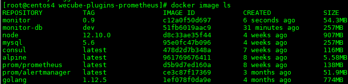

# WeCube-Plugins-Prometheus Compile Guide

## 编译前准备
1. 准备一台linux主机，为加快编译速度， 资源配置建议4核8GB或以上；
2. 操作系统版本建议为ubuntu16.04以上或centos7.3以上；
3. 网络需要可通外网(需从外网下载安装软件)；
4. 安装Git
	- yum安装 
	```
 	yum install -y git
 	```
	- 手动安装，请参考[git安装文档](git_install_guide.md)

5. 安装docker1.17.03.x以上
	- 安装请参考[docker安装文档](docker_install_guide.md)


## 编译过程
1. 通过github拉取代码

	切换到本地仓库目录， 执行命令 
	
	```
	cd /data	
	git clone https://github.com/WeBankPartners/wecube-plugins-prometheus.git
	```

	根据提示输入github账号密码， 即可拉取代码到本地。
	拉取完成后， 可以在本地目录上看到wecube-plugins-prometheus目录， 进入目录，结构如下：

	
	
2. 拉取Prometheus官方docker镜像
    ```bash
    docker pull prom/prometheus
    docker pull prom/alertmanager
    docker pull consul
    ```
    prom/prometheus 和 prom/alertmanager 是Prometheus的监控主服务镜像和告警管理镜像  
    consul是用来注册发现监控对象的服务  
    查看镜像列表  
    

3. 制作应用镜像
	
	在代码根目录下执行

    ```bash
    make image
	```
	
	如下图：

	

	将制作monitor的运行镜像。

	如果还需要制作monitor-db的数据库镜像，执行以下命令：

	```
	chmod +x build/db/build-image.sh
	./build/db/build-image.sh
	```

	镜像制作完成后， 执行命令：

	```
	docker images
	```
	
	可查看镜像列表
	
	
	
4. 镜像保存
	
	执行以下命令将镜像保存到linux目录：
	
	```
	docker save -o prometheus.tar prom/prometheus
	docker save -o alertmanager.tar prom/alertmanager
	docker save -o consul.tar consul
	docker save -o monitor.tar monitor
	docker save -o monitor-db.tar monitor-db
	```

	可在当前目录下看到保存成功的文件，将镜像文件发送到部署机器， 即可开始部署。
	也可以将镜像上传到远程镜像仓库， 部署时从远程镜像仓库拉取。