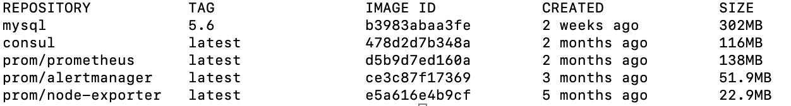
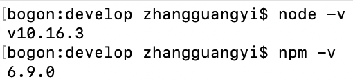
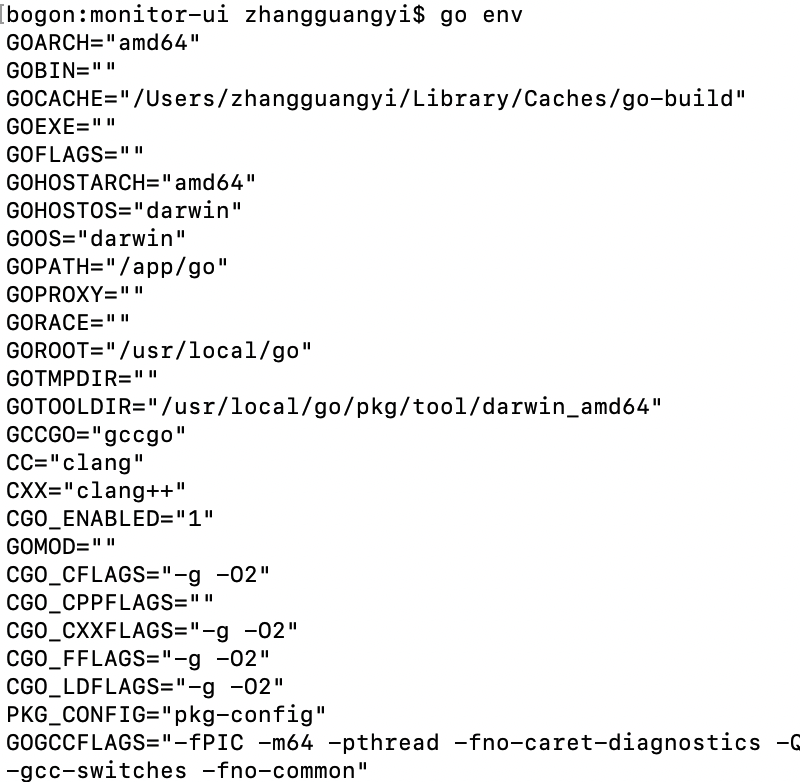
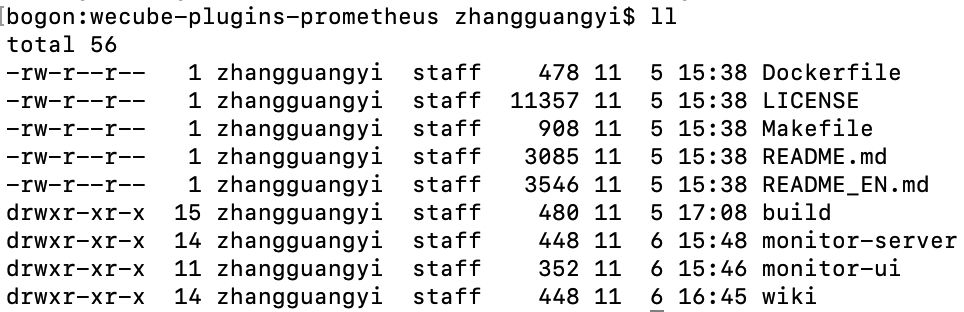
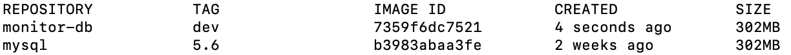
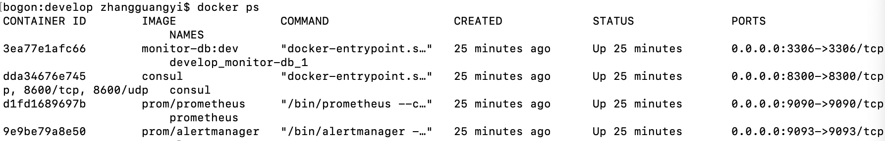

# Open-Monitor 本地开发环境配置

## 步骤
(暂不支持windows，后续会持续更新windows版) 
1. 安装 [docker](docker_install_guide.md) 和 [docker-compose](docker-compose_install_guide.md)
2. 获取prometheus官方docker镜像和服务发现组件consul与mysql(如果本地有mysql可以不用)  
    ```bash
    docker pull prom/prometheus
    docker pull prom/alertmanager
    docker pull consul
    docker pull mysql:5.6
    ```
    使用 docker images 查看获取的镜像  
    
    
3. 安装nodejs和golang  
    nodejs:  
    下载相应系统的最新包并安装，链接:[node中文网](http://nodejs.cn/download)    
        安装完后可以查看软件版本信息  
          
        
    golang:  
    下载相应系统的最新包并安装，链接:[golang中文网](https://studygolang.com/dl)  
    安装完后要配置 GOROOT 和 GOPATH 环境变量  
    GOROOT是安装包的路径   
    GOPATH可以随便设一个目录，是声明golang的工作目录，依赖包会在该目录下找  
    可以用 go env 查看 golang 的信息，如果系统提示无go命令，把$GOROOT/bin加到$PATH下  
    
    
    
4. 克隆代码  
    为了方便monitor-server应用查找依赖包，请在 $GOPATH/src/github.com/WeBankPartners下clone项目
    ```bash
    mkdir -p $GOPATH/src/github.com/WeBankPartners
    cd $GOPATH/src/github.com/WeBankPartners
    git clone https://github.com/WeBankPartners/open-monitor.git
    cd open-monitor
    ls -l
    ```
    项目文件详情  
      
    
    
5. 制作mysql镜像，把sql脚本等打进镜像里 (如果已有可用的mysql，把wiki/db里的脚本导入即可)   
    进入 build/db 目录里
    ```bash
    chmod +x build-image.sh
    ./build-image.sh
    ```
    使用 docker images 查看生成的镜像
    
    
6. 启动docker容器  
    进入到build/develop目录中  
    在 **start.sh** 中修改容器映射的本地目录
    ```bash
    MONITOR_BASE_PATH=/app/docker/monitor
    ```
    把上面 /app/docker/monitor 改成你本地的另一个目录，用来保存数据  
    启动 docker compose 去拉起Prometheus和mysql的服务
    ```bash
    chmod +x *.sh
    ./start.sh
    ```
    启动后用 docker ps 查看docker容器运行状态
      
    
    停止：  
    ```bash
    ./stop.sh
    ```

7. 编译前端  
    进入到 monitor-ui 目录中  
    先执行 npm install 安装依赖包，再执行 npm run build 编译打包，然后把dist里的生成文件拷贝到monitor-server/public下
    ```bash
    npm install
    npm run build
    cp -r dist/* ../monitor-server/public/
    ```
    
8. 运行monitor后端  
    进入到 monitor-server 目录中  
    运行
   ```bash
   go run main.go -c ../build/develop/monitor.json
   ```
   程序启动后访问 http://127.0.0.1:8088/monitor
    
9. 安装agent并注册监控对象查看视图  
    安装agent说明文档: [agent安装说明](install_agent.md)  
    安装完agent后在页面上的 配置 --> 对象 上新增，选择对应的对象类型和填入Ip端口，保存成功后可在 视图 --> 对象视图 里通过Ip搜索到对象并查看视图
    
    
    
    