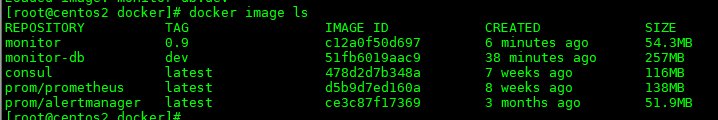

# WeCube-Plugins-Prometheus安装指引

WeCube-plugins-prometheus运行环境需要5个组件：  
prometheus、alertmanager、consul、monitor、monitor-db（mysql） 
这5个组件都已做成docker镜像，本安装指引通过docker-compose的方式启动这3个容器，不需要再单独安装mysql服务。用户也可以自行安装mysql，修改部分配置文件即可。

## 安装前准备
1. 准备一台linux主机，资源配置建议为4核8GB或以上。
2. 操作系统版本建议为ubuntu16.04以上或centos7.3以上。
3. 建议网络可通外网(需从外网下载部分软件)。
4. 安装docker1.17.03.x以上版本以及docker-compose命令。
	- docker安装请参考[docker安装文档](docker_install_guide.md)
	- docker-compose安装请参考[docker-compose安装文档](docker-compose_install_guide.md)


## 加载镜像

   通过文件方式加载镜像，执行以下命令：

   ```
   docker load --input prometheus.tar
   docker load --input alertmanager.tar
   docker load --input consul.tar
   docker load --input monitor.tar
   docker load --input monitor-db.tar 
   ```

   导入镜像， 再执行命令

   ```
	docker images
   ```

   能看到镜像已经导入：

   

   记下镜像列表中的镜像名称以及TAG， 在下面的配置中需要用到。

## 配置
1. 建立执行目录和相关文件
	
	在部署机器上建立安装目录，新建以下4个文件：

	[monitor.cfg](../build/monitor.cfg)

	[install.sh](../build/install.sh)

	[uninstall.sh](../build/uninstall.sh)

	[docker-compose.tpl](../build/docker-compose.tpl)

2. build/monitor.cfg配置文件，该文件包含如下配置项，用户根据各自的部署环境替换掉相关值。

	```	
    #monitor-server
    monitor_image_name=wecube-plugins-prometheus:0.9
    monitor_server_port=8080
    
    #database
    database_image_name=monitor-db:dev
    database_init_password=default
	```

	 配置项                    |说明
	 -------------------------|--------------------
	 monitor_server_port      |monitor的http服务端口
	 monitor_image_name       |monitor的docker镜像名称及TAG，请填入在“加载镜像”章节中看到的镜像名称以及TAG，需要保持一致， 例如：monitor:a092a47
	 database_image_name      |monitor依赖的数据库docker镜像名称及TAG，请填入在“加载镜像”章节中看到的镜像名称以及TAG，需要保持一致， 例如：monitor-db:dev
	 database_init_password   |monitor依赖的数据库root用户对应的初始化密码


3. install.sh文件。

	```bash
	#!/bin/bash
    set -ex
    if ! docker --version &> /dev/null
    then
        echo "must have docker installed"
        exit 1
    fi
    
    if ! docker-compose --version &> /dev/null
    then
        echo  "must have docker-compose installed"
        exit 1
    fi
    
    mkdir -p ~/app/docker/prometheus
    mkdir -p ~/app/docker/prometheus/rules
    mkdir -p ~/app/docker/alertmanager
    mkdir -p ~/app/docker/monitor
    cp ../monitor-server/conf/docker/prometheus.yml ~/app/docker/prometheus
    cp ../monitor-server/conf/docker/alertmanager.yml ~/app/docker/alertmanager
    cp ../monitor-server/conf/docker/monitor.json ~/app/docker/monitor/default.json
    
    source monitor.cfg
    
    sed "s~{{MONITOR_DATABASE_IMAGE_NAME}}~$database_image_name~g" docker-compose.tpl > docker-compose.yml
    sed -i "s~{{MYSQL_ROOT_PASSWORD}}~$database_init_password~g" docker-compose.yml
    sed -i "s~{{MONITOR_IMAGE_NAME}}~$monitor_image_name~g" docker-compose.yml
    sed -i "s~{{MONITOR_SERVER_PORT}}~$monitor_server_port~g" docker-compose.yml
    
    sed -i "s~{{MYSQL_ROOT_PASSWORD}}~$database_init_password~g" ~/app/docker/monitor/default.json
    sed -i "s~{{MONITOR_SERVER_PORT}}~$monitor_server_port~g" ~/app/docker/monitor/default.json
    
    docker-compose  -f docker-compose.yml  up -d
	```

4. uninstall.sh文件。

	```bash
	#!/bin/bash
    docker-compose  -f docker-compose.yml down -v
	```

5. docker-compose.tpl文件
	
	此文件中配置了要安装的服务：prometheus、alertmanager、consul、monitor、monitor-db。
	如果已有mysql，在文件中将monitor-db这两段内容注释掉，在monitor-server/conf/docker/monitor.json配置中，手动修改里面的store-mysql项配置即可。
	
	详细代码如下：

	```yaml
	version: '2'
    services:
      consul:
        image: consul
        container_name: consul
        restart: always
        dns_search: .
        volumes:
          - consul-data:/consul/data
        ports:
          - "8300:8300"
          - "8400:8400"
          - "8500:8500"
        networks:
          - monitor
      alertmanager:
        image: prom/alertmanager
        container_name: alertmanager
        restart: always
        dns_search: .
        volumes:
          - alertmanager-data:/alertmanager
          - ~/app/docker/alertmanager:/etc/alertmanager
        ports:
          - "9093:9093"
        networks:
          - monitor
        command:
          - --config.file=/etc/alertmanager/alertmanager.yml
          - --web.listen-address=:9093
          - --cluster.listen-address=:9094
      prometheus:
        image: prom/prometheus
        container_name: prometheus
        restart: always
        dns_search: .
        volumes:
          - prometheus-tsdb:/prometheus
          - ~/app/docker/prometheus:/etc/prometheus
        ports:
          - "9090:9090"
        networks:
          - monitor
        command:
          - --config.file=/etc/prometheus/prometheus.yml
          - --web.enable-lifecycle
      monitor-db:
        image: {{MONITOR_DATABASE_IMAGE_NAME}}
        restart: always
        command: [
                '--character-set-server=utf8mb4',
                '--collation-server=utf8mb4_unicode_ci',
                '--default-time-zone=+8:00',
                '--max_allowed_packet=4M'
        ]
        volumes:
          - /etc/localtime:/etc/localtimell
        environment:
          - MYSQL_ROOT_PASSWORD={{MYSQL_ROOT_PASSWORD}}
        ports:
          - 3306:3306
        volumes:
          - monitor-db-data:/var/lib/mysql
      monitor-server:
        image: {{MONITOR_IMAGE_NAME}}
        restart: always
        volumes:
          - /etc/localtime:/etc/localtime
          - ~/app/docker/monitor:/app/monitor/conf
          - ~/app/docker/prometheus/rules:/app/monitor/conf/rules
        ports:
          - {{MONITOR_SERVER_PORT}}:{{MONITOR_SERVER_PORT}}
    
    networks:
      monitor:
        driver: bridge
    
    volumes:
      consul-data:
      alertmanager-data:
      prometheus-tsdb:
      monitor-db-data:
	```

## 执行安装
1. 执行如下命令，通过docker-compose拉起WeCube-plugins-prometheus服务。
	
	```
	/bin/bash ./install.sh
	```
 
2. 安装完成后，访问monitor的url，确认页面访问正常。
	http://monitor_server_ip:monitor_server_port

## 卸载
执行如下命令，通过docker-compose停止WeCube-plugins-prometheus服务。

```
/bin/bash ./uninstall.sh
```

## 重启
执行如下命令，通过docker-compose停止WeCube-plugins-prometheus服务。

```
/bin/bash ./uninstall.sh
```

根据需要修改monitor.cfg配置文件，重启服务

```
/bin/bash ./install.sh
```