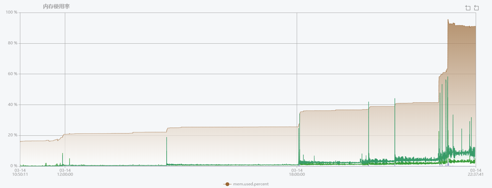

## Open-Monitor压力测试报告
### 环境
主机->Vmware Centos 7.6.1810 [2核4G]  
应用->Docker18.06.3-ce下运行的Open-monitor:v1.3.1.10  
内置Prometheus version 2.14.0  

### 结果
| node_exporter数量 | metric数 | cpu(os) | mem(os) | mem(prometheus) | disk(iops) | network | storage-24h(根据官方公式 每秒样本数*保存时间*(1[min]或2[max])) | storage-30d(配置的本地存储时间上限) |
| ---- | ---- | ---- | ---- | ---- | ---- | ---- | ---- | ---- |
| 500 | 23w | avg-3% p95-5% | 984MB | 142MB | <10 | in-avg 32KB/s  out-avg 25KB/s | 24h的容量预计在 1.85GB[min]-3.7GB[max] | 30d的容量预计在 55.5GB[min]-111GB[max] |
| 1000 | 46w | avg-5% p95-8% | 1112MB | 182MB | <10 | in-avg 62KB/s  out-avg 49KB/s | 24h的容量预计在 3.7GB[min]-7.4GB[max] | 30d的容量预计在 111GB[min]-222GB[max] |
| 2000 | 92w | avg-10% p95-13% | 1537MB | 263MB | <10 | in-avg 123KB/s  out-avg 98KB/s | 24h的容量预计在 7.4GB[min]-14.8GB[max] | 30d的容量预计在 222GB[min]-444GB[max] |
| 3000 | 138w | avg-17% p95-20% | 1708MB | 337MB | <10 | in-avg 183KB/s  out-avg 147KB/s | 24h的容量预计在 11.1GB[min]-22.2GB[max] | 30d的容量预计在 333GB[min]-666GB[max] |
| 5000 | 230w | avg-25% p95-30% | 3611MB | 510MB | <10 | in-avg 305KB/s  out-avg 244KB/s | 24h的容量预计在 18.5GB[min]-37GB[max] | 30d的容量预计在 555GB[min]-1110GB[max] |

### 趋势
cpu:  

mem:  

