# Open-Monitor 用户手册

## 主菜单介绍
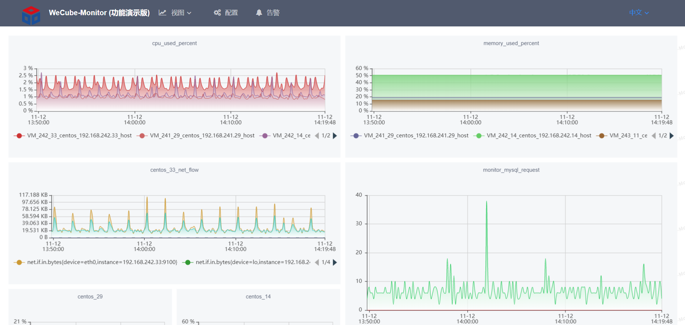  
Open-Monitor的功能总体分为: 视图、配置、告警展示。下面详细介绍每个菜单下的每个功能。

## 视图  
视图包括 对象视图、指标配置、自定义视图。
### 对象视图  
对象视图可以快速地展示各类型监控对象的基础监控指标，包括主机、Mysql、Redis、Tomcat等
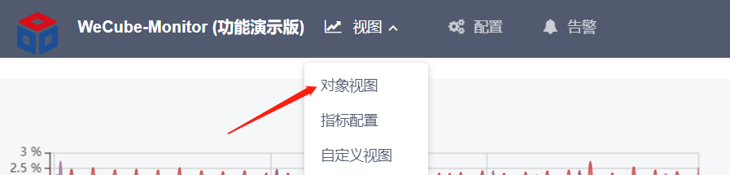  
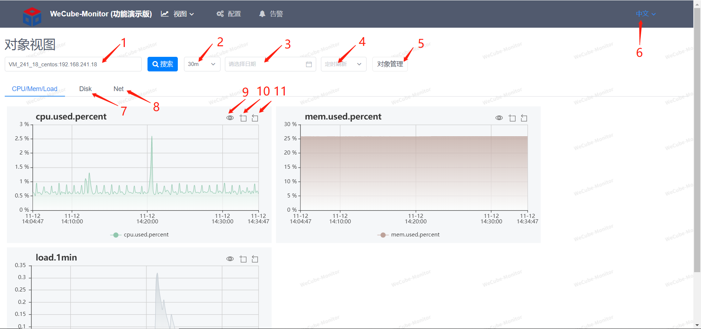  
1、可根据ip或主机名实例名来模糊搜索监控对象  
2、可选择视图展示的时间区间  
3、可选择视图展示的日期区间  
4、可选择定时刷新的时间间隔  
5、可快速跳转到该对象告警配置页面  
6、可切换中英文显示  
7、可切换视图页查看主机磁盘指标视图  
8、可切换视图页查看主机网络指标视图  
9、可放大图表  
10、点击后可在图表上拖拉图表区间  
11、点击后可恢复图表区间  

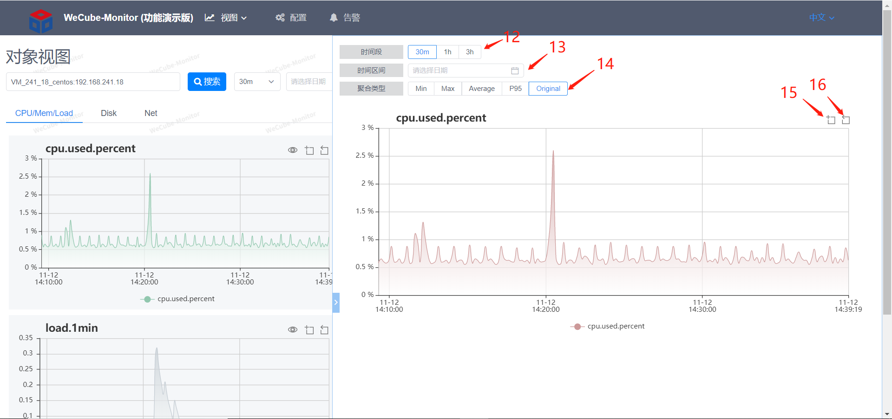 
12、可选择视图展示的时间区间  
13、可选择视图展示的日期区间  
14、可选择视图聚合的方式，聚合是指把多个点合成一个点来减少显示点数，加快图表显示  
15、点击后可在图表上拖拉图表区间  
16、点击后可恢复图表区间  

### 指标配置  
指标配置可以配置监控指标名与Prometheus表达式的映射关系  
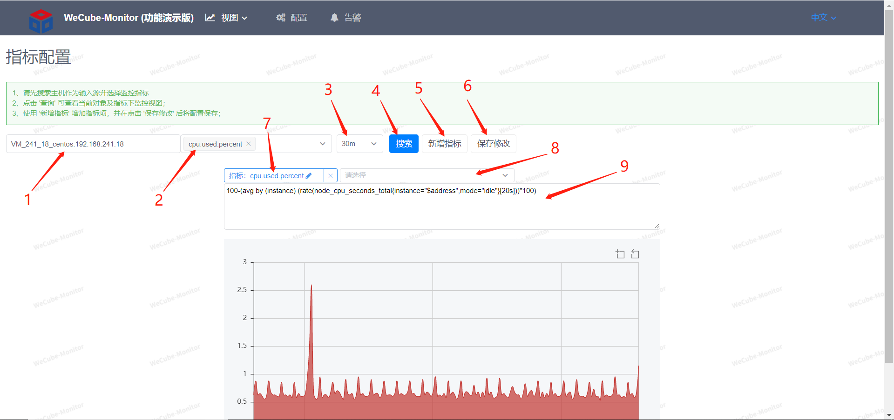
1、可根据ip或主机名实例名来模糊搜索监控对象  
2、可选择该监控对象上已配置好的指标名  
3、可选择视图展示的时间区间  
4、点击搜索可展示下面显示的表达式的查询图表，会把多个表达式的值放一个图表里  
5、新增一个指标名  
6、保存所做的修改  
7、可直接改指标名  
8、可选择该监控对象采集上来的基础Prometheus指标  
9、可编辑表达式  

### 自定义视图
自定义视图提供可让用户自行配置图表主页的编辑界面，可拖拽图表大小，可配置各个图表内容  
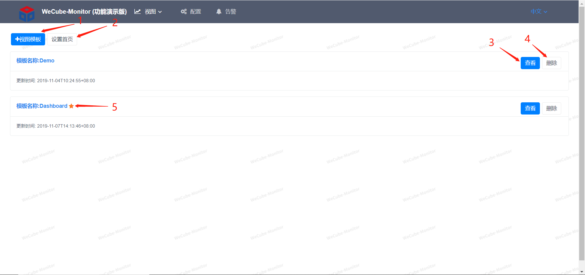
1、新增一个视图模板  
2、可设置某个自定义视图为首页  
3、查看自定义视图，进入编辑页面  
4、删除视图  
5、设置为首页的视图会有个星星标记 
 
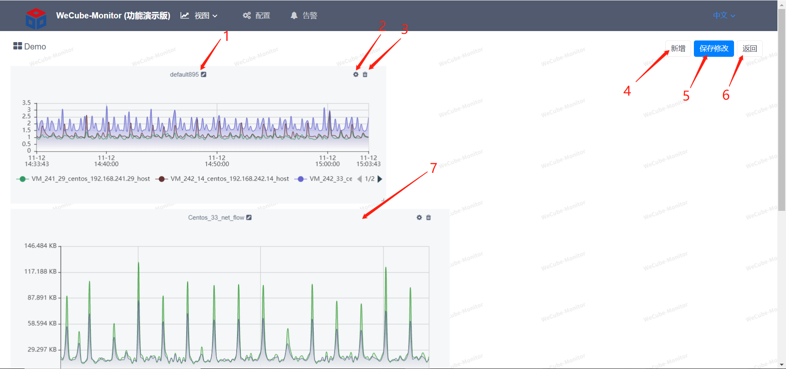
1、可修改图表的标题
2、点击可进入图表配置界面  
3、可删除该图表  
4、新增图表  
5、保存修改  
6、返回到自定义视图选择页面  
7、可拖拉该图表位置  

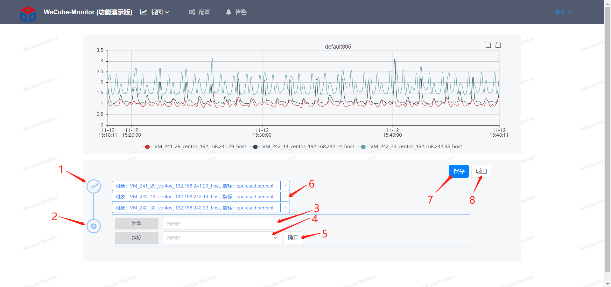
1、图表的曲线配置  
2、图表的标题和单位配置  
3、可根据ip或主机名实例名来模糊搜索监控对象  
4、可选择该监控对象上已配置好的指标名  
5、点确定后可增加该对象指标的曲线到上面的图表上  
6、可删除已增加的对象指标  
7、保存配置  
8、返回到上一个页面  

## 告警配置
告警配置提供对象管理、组管理、阀值配置、日志告警配置等功能  
### 监控对象管理
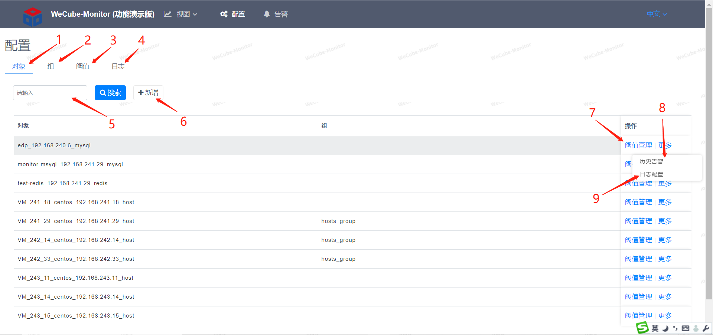
1、监控对象管理  
2、对象组管理  
3、阀值配置管理  
4、日志告警配置管理  
5、可根据ip或主机名实例名来模糊搜索监控对象  
6、新增告警对象
7、点击跳转到阀值配置页面  
8、点击查看该对象历史告警  
9、点击跳转到日志告警配置页面  
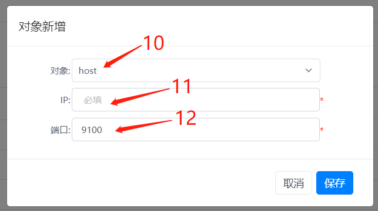
10、选择监控对象类型  
11、填入对象agent的ip  
12、填入对象agent的端口  

### 对象组管理
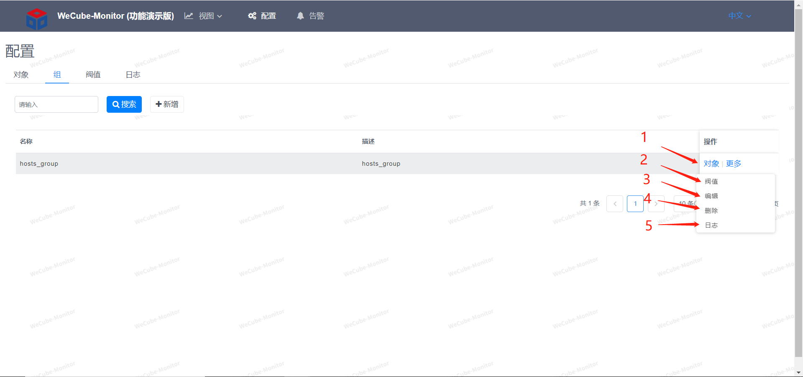
1、可跳转到对象管理页面，查看该组内的对象，可在那增加删除成员对象  
2、可跳转到阀值页面给组配置阀值策略，会对该组内的所有对象都生效  
3、可编辑组的名称和描述  
4、可删除该组  
5、可跳转到日志告警页面给组配置日志告警，会对该组内的所有对象都生效  

### 阀值配置

1、可选择是对象还是组  
2、可模糊搜索对象或组  
3、组名，如果所选择是对象，会把它所属组的策略也给显示出来，但是不能修改组的策略  
4、对象名  
5、可以给对象增加阀值策略  
6、编辑阀值策略  
7、删除阀值策略  
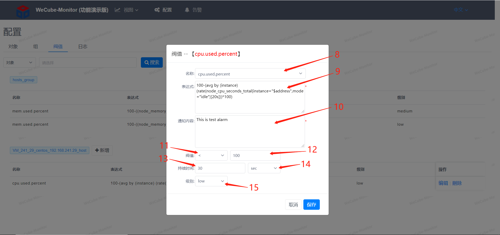
8、可选择指标  
9、选好指标后会自动带出已在指标配置上配置好的Prometheus表达式  
10、填写通知内容  
11、选择条件  
12、填写阀值  
13、持续异常时间数值  
14、时间单位  
15、告警级别，有高中低三个级别  

### 日志告警配置

1、可选择是对象还是组  
2、可模糊搜索对象或组  
3、可新增日志告警配置  
4、新增该日志路径下的关键字告警  
5、编辑该告警配置  
6、删除配置  
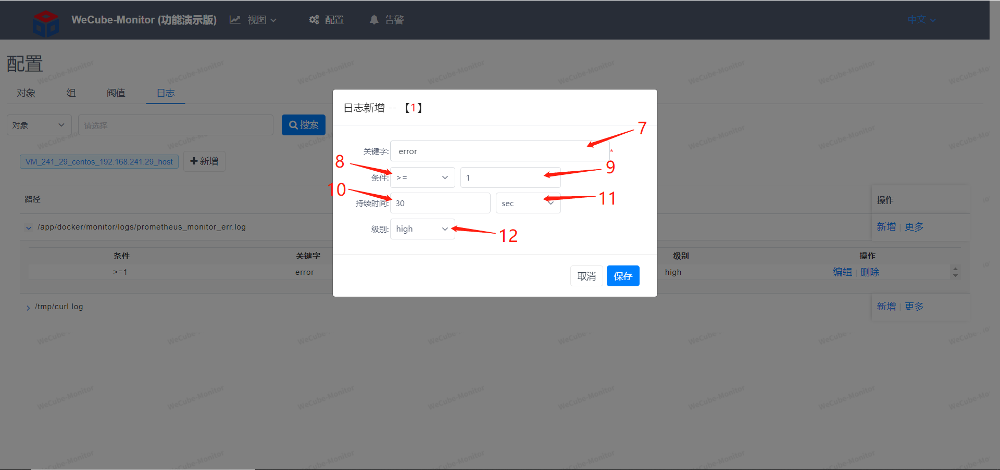
7、日志里的关键字  
8、关键字出现条件  
9、关键字出现次数  
10、持续异常时间数值  
11、时间单位  
12、告警级别，有高中低三个级别   

## 告警视图
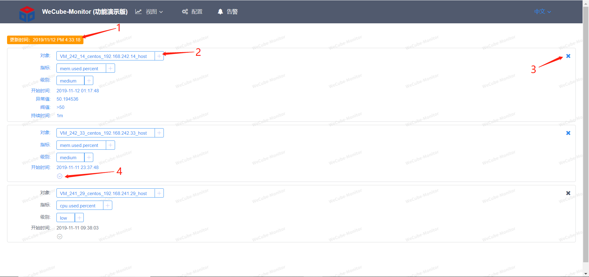
1、页面会每10秒刷新，此处显示上次刷新时间  
2、该标签上的加号可点击给该页面的告警显示增加过滤条件  
3、可手动删除某条告警  
4、点击可展开告警详细信息  

